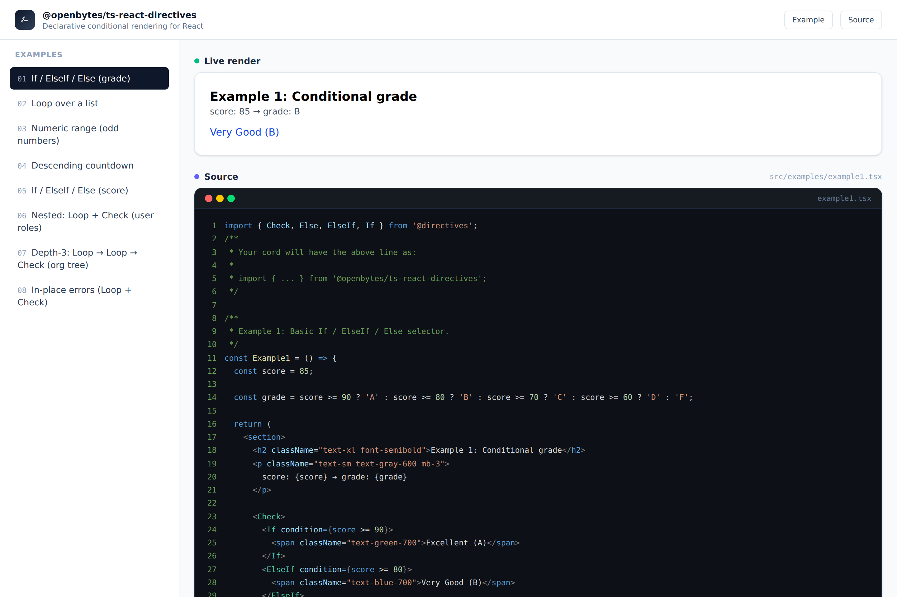
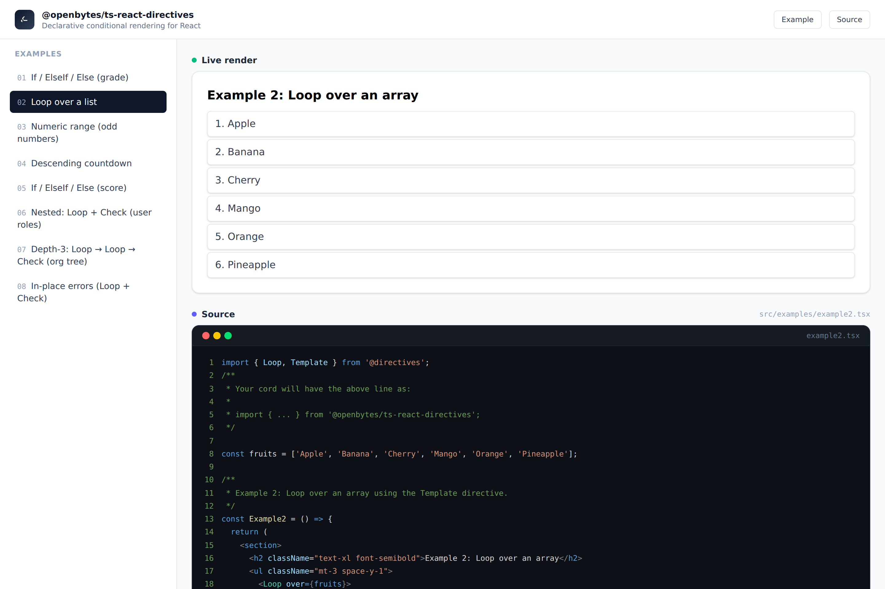
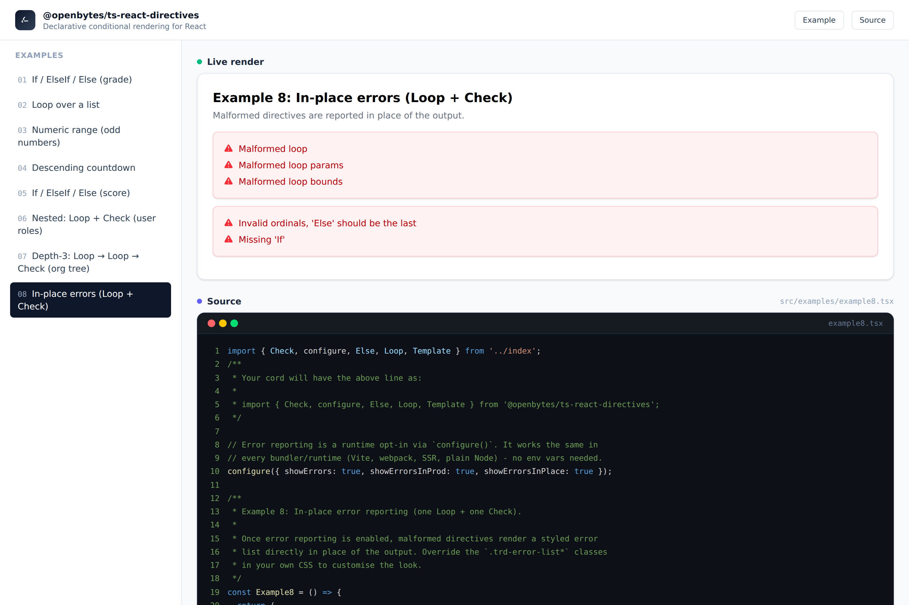

# ts-react-directives — Developer Guide

[](https://www.npmjs.com/package/@openbytes/ts-react-directives)
[](./LICENSE.md)
[](https://react.dev)

Developer documentation for `@openbytes/ts-react-directives` — a React/TypeScript library that brings
Angular-style directives to React for declarative conditional rendering and loops. It removes the
cognitive load of nested ternary expressions and verbose `map()` blocks.

## Table of contents

- [ts-react-directives — Developer Guide](#ts-react-directives--developer-guide)
  - [Table of contents](#table-of-contents)
  - [Examples \& demo](#examples--demo)
  - [Installation](#installation)
    - [_Requirements_](#requirements)
  - [Usage](#usage)
    - [Conditional rendering: `Check`, `If`, `ElseIf`, `Else`](#conditional-rendering-check-if-elseif-else)
    - [Loops: `Loop` and `Template`](#loops-loop-and-template)
    - [Nesting directives](#nesting-directives)
  - [Error reporting (opt-in)](#error-reporting-opt-in)
    - [Runtime configuration with `configure()`](#runtime-configuration-with-configure)
    - [Environment variables (Node / SSR only)](#environment-variables-node--ssr-only)
    - [Precedence](#precedence)
  - [Styling and overriding the error list](#styling-and-overriding-the-error-list)
    - [Default styles](#default-styles)
    - [Public style hooks](#public-style-hooks)
    - [Tailwind caveats](#tailwind-caveats)
  - [Project structure](#project-structure)
  - [Available scripts](#available-scripts)
  - [License, security and authors](#license-security-and-authors)

---

## Examples & demo

See a demo with several examples (and the source for each) is published to GitHub Pages: **[demo](https://skycodr.github.io/ts-react-directives/)**

_**Examples**:_



_Example 1 — conditional grade via `If` / `ElseIf` / `Else`._



_Example 2 — iterating an array with `Loop` and `Template`._



_Example 8 — malformed directives reported in place with the styled error list._

The screenshots live in `./docs/screenshots/` and can be regenerated by serving the built demo and
capturing each example view.

## Installation

### _Requirements_

- Node.js >= 18
- React 19 and `react-dom` 19 as peer dependencies (installed together with the library)

**Recommended toolchain:** pnpm + Vite. The library is however bundler-agnostic and works with any
Vite, webpack, Rollup or esbuild setup, as well as SSR runtimes.

Using **pnpm** _(preferred)_:

```shell
pnpm add @openbytes/ts-react-directives
```

Using **npm**:

```shell
npm install @openbytes/ts-react-directives
```

Using **yarn**:

```shell
yarn add @openbytes/ts-react-directives
```

Using **bun**:

```shell
bun add @openbytes/ts-react-directives
```

The peer dependencies (`react`, `react-dom`) are declared with `^19.0.0`; most package managers
install them automatically. Afterwards, import the directives:

```tsx
import { Check, Else, ElseIf, If, Loop, Template, configure } from '@openbytes/ts-react-directives';
```

## Usage

### Conditional rendering: `Check`, `If`, `ElseIf`, `Else`

Wrap a set of mutually exclusive branches in `Check`. The first `If` / `ElseIf` whose `condition` is
`true` wins; if none match, `Else` renders.

```tsx
import { Check, Else, ElseIf, If } from '@openbytes/ts-react-directives';

const ScoreLabel = ({ score }: { score: number }) => (
  <Check>
    <If condition={score >= 90}>
      <span>Excellent (A)</span>
    </If>
    <ElseIf condition={score >= 80}>
      <span>Very Good (B)</span>
    </ElseIf>
    <ElseIf condition={score >= 70}>
      <span>Good (C)</span>
    </ElseIf>
    <Else>
      <span>Keep trying (D / F)</span>
    </Else>
  </Check>
);
```

`Check` requires at least one `If` as the first branching element. A lone `Else` is invalid and is
reported by the error reporting feature.

### Loops: `Loop` and `Template`

Iterate over an array with `over`:

```tsx
import { Loop, Template } from '@openbytes/ts-react-directives';

const fruits = ['Apple', 'Banana', 'Cherry', 'Mango', 'Orange', 'Pineapple'];

const FruitList = () => (
  <ul>
    <Loop over={fruits}>
      <Template<string>>
        {({ data, index }) => (
          <li key={data}>
            {index + 1}. {data}
          </li>
        )}
      </Template>
    </Loop>
  </ul>
);
```

Iterate over a numeric range with `from`, `to` and an optional `step` (defaults to `1`):

```tsx
const OddNumbers = () => (
  <Loop from={1} to={9} step={2}>
    <Template<number>>{({ data }) => <span>{data}</span>}</Template>
  </Loop>
);
```

The `Template` render-function receives `{ data: T, index: number }`, where `T` is inferred from the
generic you pass to `Template`, or from the item type of `over`.

### Nesting directives

Directives compose naturally — `Loop` and `Check` can be nested to arbitrary depth.

```tsx
const RoleMatrix = () => (
  <Loop over={users}>
    <Template<User>>
      {({ data: user, index }) => (
        <Check>
          <If condition={user.role === 'admin'}>
            <span>{index}: Administrator</span>
          </If>
          <ElseIf condition={user.role === 'editor'}>
            <span>{index}: Editor</span>
          </ElseIf>
          <Else>
            <span>{index}: Viewer</span>
          </Else>
        </Check>
      )}
    </Template>
  </Loop>
);
```

## Error reporting (opt-in)

Invalid directive usage (a `Loop` slicing outside its array, an `Else` without an `If`, and similar)
is **invisible by default**. Error reporting must be enabled explicitly, either at runtime with
`configure()` or — on Node/SSR — through environment variables.

> [!NOTE]
> No build-time environment values are baked into the published package. Configuration is always
> resolved at runtime, so it behaves identically across Vite, webpack, SSR and plain Node.

### Runtime configuration with `configure()`

Call `configure()` once at the entry point of your application, before the first render:

```tsx
import { configure } from '@openbytes/ts-react-directives';

configure({
  mode: 'development',
  showErrors: true,
  showErrorsInProd: true,
  showErrorsInPlace: true,
});
```

The available options (`ErrorReportingOptions`):

| Option              | Type                                      | Default      | Description                                                     |
| ------------------- | ----------------------------------------- | ------------ | --------------------------------------------------------------- |
| `mode`              | `'development' \| 'production' \| 'test'` | `production` | Build/runtime mode used by the show-error rules.                |
| `showErrors`        | `boolean`                                 | `false`      | Master switch for error reporting.                              |
| `showErrorsInProd`  | `boolean`                                 | `false`      | When `true`, errors are reported even in `production` mode.     |
| `showErrorsInPlace` | `boolean`                                 | `false`      | When `true`, errors render inline where the directive was used. |

How the rules combine:

```ts
const showErrors = config.showErrors && (config.mode !== 'production' || config.showErrorsInProd);
```

Errors are only rendered when `showErrors` is `true` **and** the mode is not `'production'` (unless
`showErrorsInProd` is also `true`). In-place rendering additionally requires `showErrorsInPlace`.

> [!TIP]
> Call `configure()` at module scope of your entry file (like `Example8` in this repository does) so
> it runs before any component renders. Calling it again later changes behavior on the next render.

### Environment variables (Node / SSR only)

When running on Node (tests, SSR, server-side rendering), configuration can also be provided through
environment variables. Browsers do not see `process.env`, so in the browser configuration comes from
`configure()` overrides and the defaults only.

| Variable                   | Equivalent option   | Resolves to `true` when               |
| -------------------------- | ------------------- | ------------------------------------- |
| `TRD_SHOW_ERRORS`          | `showErrors`        | the value is exactly `"true"`         |
| `TRD_SHOW_ERRORS_IN_PROD`  | `showErrorsInProd`  | the value is exactly `"true"`         |
| `TRD_SHOW_ERRORS_IN_PLACE` | `showErrorsInPlace` | the value is exactly `"true"`         |
| `MODE` or `NODE_ENV`       | `mode`              | `development` / `production` / `test` |

```shell
MODE=development TRD_SHOW_ERRORS=true TRD_SHOW_ERRORS_IN_PLACE=true node server.js
```

> [!WARNING]
> Boolean variables only resolve to `true` when set to the literal string `"true"`. Undefined, empty
> or any other value resolves to `false`. An invalid `MODE` / `NODE_ENV` value falls back to
> `production`.

### Precedence

Configuration is resolved in this order — first match wins:

1. `configure()` overrides (highest priority, reliable in every runtime).
2. Environment variables (Node/SSR only).
3. Safe defaults (`false`, mode `production`).

To disable error reporting again, call `configure({ showErrors: false })` or simply remove the calls
and unset the variables — the defaults are silent.

## Styling and overriding the error list

### Default styles

The error list (`src/components/Errors.tsx`) renders as a clean red alert panel — red border, tinted
background, shadow, and a warning icon — built with Tailwind CSS utilities. **The styles are compiled
into the published package** (`index.css`) and injected automatically by the bundler, so the error
list looks correct out of the box without any Tailwind setup in your application.

### Public style hooks

The `Errors` component exposes four stable class names (`trd-*`) that carry no styles of their own —
they exist purely so you can theme the component without fighting the compiled CSS:

| Class                         | Element          |
| ----------------------------- | ---------------- |
| `.trd-error-list`             | the list root    |
| `.trd-error-list__item`       | each error row   |
| `.trd-error-list__item--text` | the message text |
| `.trd-error-list__icon`       | the warning icon |

Override them in your own stylesheet:

```css
.trd-error-list {
  border: 1px solid #b91c1c;
  border-left-width: 4px;
  background-color: #fef2f2;
  border-radius: 0.5rem;
  padding: 1rem 1.25rem;
}

.trd-error-list__item--text {
  color: #991b1b;
  font-size: 0.875rem;
  line-height: 1.25rem;
}
```

If your application already uses Tailwind, you can restyle through the hooks with `@apply`:

```css
.trd-error-list {
  @apply my-6 border-l-4 border-red-500 bg-red-100 p-6;
}
```

Because the default styling comes from single-class utilities on the same element, add your overrides
**after** the library stylesheet is loaded (or match it with a higher-specificity rule) so the cascade
picks yours.

### Tailwind caveats

> [!WARNING] > **Consumers without Tailwind are fine** — the published package ships a precompiled stylesheet, so
> no Tailwind is needed. However, the error styles only render correctly if that compiled CSS reaches
> the browser. Watch out for:
>
> - **Consuming from source.** If you copy or link the library source (e.g. `src/components/Errors.tsx`)
>   into your own project, Tailwind will **not** generate those utility classes unless it scans the
>   library files. Add them to your content/source scan, e.g.:
>   `@import 'tailwindcss' source("node_modules/@openbytes/ts-react-directives");` (Tailwind v4),
>   or the equivalent content glob for your Tailwind version.
> - **CSS purging.** If your bundler purges unused CSS (e.g. `purgecss`, some framework setups),
>   keep the library's `index.css` from being removed.
> - **SSR without stylesheet handling.** Server-side setups that skip the library-injected `<style>`
>   block will render unstyled errors; import `@openbytes/ts-react-directives/index.css` manually in
>   that case.

## Project structure

```text
├── public/                   # demo site static assets
├── src/
│   ├── directives/           # Check, If, ElseIf, Else, Loop, Template
│   ├── components/           # Errors.tsx — styled error list with trd-* hooks
│   ├── hooks/                # hooks for the directives
│   ├── utils/                # ConfigManager + configure() runtime API
│   ├── types/                # shared public types (ErrorReportingOptions, ...)
│   ├── fixtures/             # error messages and logic validation
│   ├── assets/               # index.css (Tailwind entry point)
│   ├── examples/             # demo project: App.tsx switcher + example1..8
│   └── __tests__/            # vitest + testing-library suite
├── dist/                     # published build (ESM / CJS / UMD, index.css, .d.ts)
├── vite.config.ts            # library build configuration
└── vite.config.examples.ts   # demo / examples build configuration
```

## Available scripts

Run inside the repository root (pnpm):

| Script                   | Description                                              |
| ------------------------ | -------------------------------------------------------- |
| `pnpm dev`               | Start the Vite dev server for the examples/demo.         |
| `pnpm build:lib`         | Type-check and build the library into `dist/`.           |
| `pnpm build:examples`    | Type-check and build the demo site into `dist/examples`. |
| `pnpm build`             | Build library and examples.                              |
| `pnpm preview`           | Preview the built examples.                              |
| `pnpm test`              | Run the vitest suite.                                    |
| `pnpm test:coverage`     | Run tests with coverage reporting.                       |
| `pnpm lint`              | ESLint on `src/**/*.{ts,tsx}`.                           |
| `pnpm format`            | Prettier check on `src/**/*.{ts,tsx}`.                   |
| `pnpm release[:dry-run]` | Bump version and tag via commit-and-tag-version.         |
| `pnpm publish:registry`  | Publish the package to npm.                              |
| `pnpm publish:gh-pages`  | Build and deploy the demo to GitHub Pages.               |

Pre-commit hooks (husky + lint-staged + commitlint) keep commits linted and conventionally
formatted.

## License, security and authors

- **License** — MIT. See [LICENSE.md](./LICENSE.md).
- **Security** — report vulnerabilities per the policy in [SECURITY.md](./SECURITY.md).
- **Authors** — see [AUTHORS.md](./AUTHORS.md).
- **Changelog / releases** — tagged via `commit-and-tag-version`; see the repository's releases.
- **Issues** — bug reports and feature requests: [GitHub Issues](https://github.com/skycodr/ts-react-directives/issues).
