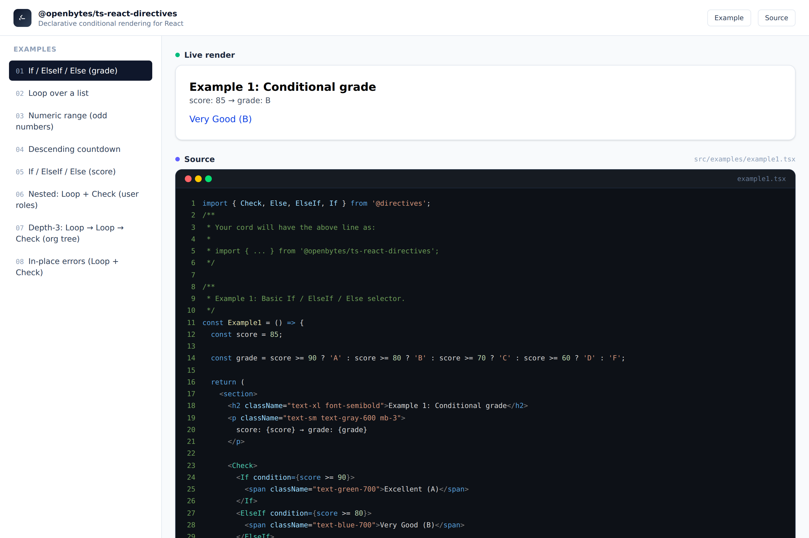
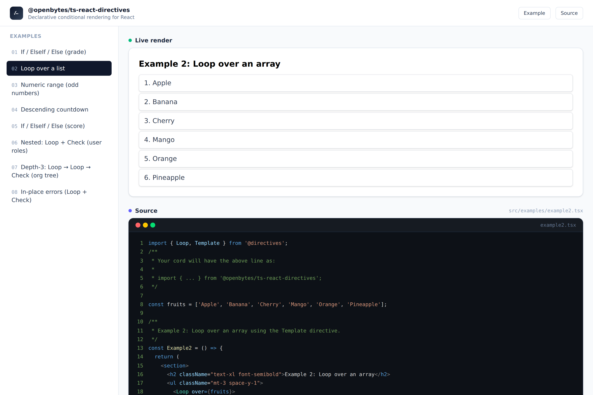
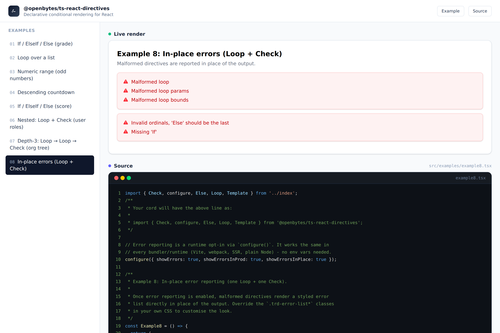

# ts-react-directives — Developer Guide

[](https://www.npmjs.com/package/@openbytes/ts-react-directives)
[](./LICENSE.md)
[](https://react.dev)

Developer documentation for `@openbytes/ts-react-directives` — a React/TypeScript library that brings
Angular-style directives to React for declarative conditional rendering and loops. It removes the
cognitive load of nested ternary expressions and verbose `map()` blocks, and adds loop control
(`break` / `continue`) without giving up declarative JSX.

## Table of contents

- [ts-react-directives — Developer Guide](#ts-react-directives--developer-guide)
  - [Table of contents](#table-of-contents)
  - [Examples \& demo](#examples--demo)
  - [Installation](#installation)
    - [_Requirements_](#requirements)
  - [Usage](#usage)
    - [Conditional rendering: `Check`, `If`, `ElseIf`, `Else`](#conditional-rendering-check-if-elseif-else)
    - [Loops: `Loop`](#loops-loop)
      - [Iterating an array: `over`](#iterating-an-array-over)
      - [Iterating a numeric range: `from`, `to`, `step`](#iterating-a-numeric-range-from-to-step)
      - [Two ways to render an item](#two-ways-to-render-an-item)
      - [Breaking out of a loop: `breakOn`](#breaking-out-of-a-loop-breakon)
      - [Skipping iterations: `continueOn`](#skipping-iterations-continueon)
      - [How the loop bounds are resolved](#how-the-loop-bounds-are-resolved)
    - [Loop recipes](#loop-recipes)
    - [Nesting directives](#nesting-directives)
  - [API reference](#api-reference)
    - [Components](#components)
    - [`Loop` props](#loop-props)
    - [Runtime \& configuration](#runtime--configuration)
    - [Types](#types)
  - [Error reporting (opt-in)](#error-reporting-opt-in)
    - [Runtime configuration with `configure()`](#runtime-configuration-with-configure)
    - [Environment variables (Node / SSR only)](#environment-variables-node--ssr-only)
    - [Precedence](#precedence)
    - [Error reference](#error-reference)
    - [Loop guardrails](#loop-guardrails)
  - [Styling and overriding the error list](#styling-and-overriding-the-error-list)
    - [Default styles](#default-styles)
    - [Public style hooks](#public-style-hooks)
    - [Tailwind caveats](#tailwind-caveats)
  - [Project structure](#project-structure)
  - [Available scripts](#available-scripts)
  - [License, security and authors](#license-security-and-authors)

---

## Examples & demo

A demo with every example below — live render plus its source — is published to GitHub Pages:
**[demo](https://skycodr.github.io/ts-react-directives/)**

Each example lives in its own file under `src/examples/` and is lazily loaded by the demo switcher
(`src/examples/App.tsx`).

| #      | Source                                        | Shows                                                                        |
| ------ | --------------------------------------------- | ---------------------------------------------------------------------------- |
| 1      | [`example1.tsx`](./src/examples/example1.tsx) | `Check` + `If` — a single conditional, driven by a toggle                     |
| 2      | [`example2.tsx`](./src/examples/example2.tsx) | `If` / `Else` — a ternary replacement                                        |
| 3      | [`example3.tsx`](./src/examples/example3.tsx) | `If` / `ElseIf` / `Else` — a grade scale driven by a slider                   |
| 4      | [`example4.tsx`](./src/examples/example4.tsx) | `Loop` over an array with an **element** child and `IteratorProps`           |
| 5      | [`example5.tsx`](./src/examples/example5.tsx) | `Loop` over `1..9` with `step: 2` and an inline **render function**          |
| 6      | [`example6.tsx`](./src/examples/example6.tsx) | Descending range — `step` derived automatically from the range direction     |
| 7      | [`example7.tsx`](./src/examples/example7.tsx) | `Loop` → `Check` → `Check` — depth-3 nesting over a descending slice          |
| 8      | [`example8.tsx`](./src/examples/example8.tsx) | Nested `Loop`s rendering a 2D matrix, guarded by a `Check`                   |
| 9      | [`example9.tsx`](./src/examples/example9.tsx) | FizzBuzz — `Loop` over `1..65` with a `Check` chain in the item component   |
| 10     | [`example10.tsx`](./src/examples/example10.tsx) | **`breakOn`** — stop at the first string in a mixed array                    |
| 11     | [`example11.tsx`](./src/examples/example11.tsx) | **`continueOn`** — skip every non-string item in a mixed array               |
| 12     | [`example12.tsx`](./src/examples/example12.tsx) | Opt-in error reporting: malformed directives degrade to a styled error list |

The two loop-control examples:

```tsx
// example10.tsx — break: nothing is rendered from the matching item onwards
<Loop over={mixedBag} breakOn={({ data }) => typeof data === 'string'}>
  {({ data }) => <span>{data}</span>}
</Loop>

// example11.tsx — continue: matching items are skipped, the rest are rendered
<Loop over={mixedBag} continueOn={({ data }) => typeof data !== 'string'}>
  {({ data }) => <pre>{data}</pre>}
</Loop>
```

_**Examples**:_



_Examples 1–3 — conditional rendering with `If` / `ElseIf` / `Else`._



_Example 4 — iterating an array with `Loop`._



_Example 12 — malformed directives reported in place with the styled error list._

The screenshots live in `./docs/screenshots/` and can be regenerated by serving the built demo and
capturing each example view.

## Installation

### _Requirements_

- Node.js >= 18
- React 19 and `react-dom` 19 as peer dependencies (installed together with the library)

**Recommended toolchain:** pnpm + Vite. The library is however bundler-agnostic and works with any
Vite, webpack, Rollup or esbuild setup, as well as SSR runtimes.

Using **pnpm** _(preferred)_:

```shell
pnpm add @openbytes/ts-react-directives
```

Using **npm**:

```shell
npm install @openbytes/ts-react-directives
```

Using **yarn**:

```shell
yarn add @openbytes/ts-react-directives
```

Using **bun**:

```shell
bun add @openbytes/ts-react-directives
```

The peer dependencies (`react`, `react-dom`) are declared with `^19.0.0`; most package managers
install them automatically. Afterwards, import the directives:

```tsx
import { Check, Else, ElseIf, If, Loop, configure } from '@openbytes/ts-react-directives';
```

## Usage

### Conditional rendering: `Check`, `If`, `ElseIf`, `Else`

Wrap a set of mutually exclusive branches in `Check`. The first `If` / `ElseIf` whose `condition` is
`true` wins; if none match, `Else` renders.

```tsx
import { Check, Else, ElseIf, If } from '@openbytes/ts-react-directives';

const ScoreLabel = ({ score }: { score: number }) => (
  <Check>
    <If condition={score >= 90}>
      <span>Excellent (A)</span>
    </If>
    <ElseIf condition={score >= 80}>
      <span>Very Good (B)</span>
    </ElseIf>
    <ElseIf condition={score >= 70}>
      <span>Good (C)</span>
    </ElseIf>
    <Else>
      <span>Keep trying (D / F)</span>
    </Else>
  </Check>
);
```

`Check` requires exactly one `If` as the first branching element. A lone `Else` — or an `ElseIf`
before the `If` — is invalid and is reported by the [error reporting](#error-reporting-opt-in)
feature. When nothing matches and there is no `Else`, `Check` renders nothing.

### Loops: `Loop`

#### Iterating an array: `over`

```tsx
import { Loop } from '@openbytes/ts-react-directives';

const fruits = ['Apple', 'Banana', 'Cherry', 'Mango', 'Orange', 'Pineapple'];

const FruitList = () => (
  <ul>
    <Loop over={fruits}>
      {({ data, index }) => (
        <li>
          {index! + 1}. {data}
        </li>
      )}
    </Loop>
  </ul>
);
```

#### Iterating a numeric range: `from`, `to`, `step`

```tsx
const OddNumbers = () => (
  <Loop<number> from={1} to={9} step={2}>
    {({ data }) => <span>{data}</span>}
  </Loop>
);
```

A range may run in reverse — the `step` is derived from the direction when it is omitted, so
`<Loop from={5} to={1} />` counts down `5, 4, 3, 2, 1`. A negative `index` is possible when a
descending range starts below zero; `data` always holds the current value of the range.

#### Two ways to render an item

`Loop` accepts exactly one child, given in one of two styles:

| Style             | Usage                                     | Typed as                          |
| ----------------- | ----------------------------------------- | --------------------------------- |
| Render function   | `{({ data, index }) => <li>...</li>}`    | `LoopRenderFunction<T>`           |
| Render element    | `<FruitItem />` as the only child         | `FC<IteratorProps<T, P>>`         |

An element child receives the item as props and is the right choice for anything non-trivial; it
can also receive its own props:

```tsx
import { IteratorProps } from '@openbytes/ts-react-directives';
import { FC } from 'react';

const FruitItem: FC<IteratorProps<string>> = ({ data, index }) => (
  <li>
    {index! + 1}. {data}
  </li>
);

type CountDownProps = { styleClasses?: string };

const CountDown: FC<IteratorProps<number, CountDownProps>> = ({ data, styleClasses }) => (
  <span className={styleClasses}>{data}</span>
);

// the extra props are merged into the cloned element
<Loop from={5} to={1}>
  <CountDown styleClasses="font-semibold" />
</Loop>;
```

The item is `{ data: T; index: number }` — fully required for the callbacks below, optional
(`data?`, `index?`) on the render side, which is why element children use `data!` / `index!`. `T` is
inferred from `over`, or from the generic you pass explicitly (`<Loop<number> ... />`).

`key` is managed per item, so do not add one yourself in the render function.

#### Breaking out of a loop: `breakOn`

`breakOn` is a predicate evaluated **before** each item is rendered. Returning `true` stops the loop
immediately: the matching item *and everything after it* is skipped.

```tsx
const mixedBag = [1, 2, 6, 32, 'hello', 1, 4, 5];

// renders: 1  2  6  32
<Loop over={mixedBag} breakOn={({ data }) => typeof data === 'string'}>
  {({ data }) => <span>{data}</span>}
</Loop>;
```

#### Skipping iterations: `continueOn`

`continueOn` is a predicate evaluated for the same item, immediately after `breakOn`. Returning `true`
skips just that item and the loop carries on.

```tsx
const mixedBag = ['Hello', 2, 6, 32, '!!!', 1, ' ', 'Mr.', 5, ' ', 3, 5, 23, 'world! :D', 24];

// renders: Hello  !!!  <space>  Mr.  <space>  world! :D
<Loop over={mixedBag} continueOn={({ data }) => typeof data !== 'string'}>
  {({ data }) => <pre>{data}</pre>}
</Loop>;
```

Rules shared by both props:

- Both are optional. Omit one (or both) and the loop behaves as if it always returned `false`.
- Both receive `{ data, index }` — the same object the render function gets. With `over`, `data` is
  the array item and `index` is its numeric position; with a numeric range, `data` is the current
  value and `index` is the loop counter.
- **`breakOn` takes precedence**: if both predicates match the same item, the loop breaks and
  `continueOn` is not even called for it.
- They apply to whatever `from` / `to` / `step` resolve to, so they work on ranges as well as arrays,
  in both directions.
- The predicates run inside the loop, so keep them pure and cheap. The render function and the
  element child are *not* called for an item that breaks or is skipped.
- Malformed loops are validated first: when a loop is invalid, the error list is rendered in place
  and neither predicate runs.

#### How the loop bounds are resolved

`Loop` derives `from`, `to` and `step` before the first iteration. `from` and `to` are inclusive;
`to` is clamped to the last valid index when it equals `over.length`, which makes an exclusive end
work as expected.

| `over` | `from` | `to` | `step` | Resolved iteration                                                     |
| ------ | ------ | ---- | ------ | ---------------------------------------------------------------------- |
| ✔      | —      | —    | —      | `0 → lastIndex`, step `1`                                             |
| ✔      | —      | —    | `±`     | array bounds, direction taken from the sign of `step`                 |
| ✔      | —      | ✔    | —      | from `0` (or `lastIndex` when `to <= 0`), step `+1` / `-1` from `to`  |
| ✔      | —      | ✔    | `±`     | as given                                                                |
| ✔      | ✔      | —    | —      | to `lastIndex` (or `0` when `from <= 0`), step `+1` / `-1` from `from`|
| ✔      | ✔      | —    | `±`     | as given                                                                |
| ✔      | ✔      | ✔    | —      | as given, step `+1` / `-1` from the range direction                     |
| —      | ✔      | ✔    | —      | as given, step `+1` / `-1` from the range direction                     |
| —      | ✔      | ✔    | `±`     | as given                                                                |

Any other combination (a range without `from`, `to` alone, an empty `over`, bounds outside the
array, a `step` that contradicts the direction, or `step: 0`) is a malformed loop: nothing is
rendered and the error is reported. See [Loop guardrails](#loop-guardrails).

### Loop recipes

**Filter items** — `continueOn` is a declarative `filter`:

```tsx
<Loop over={users} continueOn={({ data }) => data.role !== 'admin'}>
  {({ data }) => <UserCard user={data!} />}
</Loop>
```

**First match wins** — `breakOn` combined with a `Check`, instead of `find()`:

```tsx
<Loop over={attempts} breakOn={({ data }) => data!.status === 'ok'}>
  {({ index }) => (
    <Check>
      <If condition={index === 0}>
        <span>No successful attempt</span>
      </If>
      <Else>
        <span>Succeeded on attempt {index! + 1}</span>
      </Else>
    </Check>
  )}
</Loop>
```

**Take the first `n` items** — stop before the `n`-th index instead of slicing `over`:

```tsx
<Loop over={rows} breakOn={({ index }) => index === n - 1}>
  {({ data }) => <TableRow row={data!} />}
</Loop>
```

**Paginate a slice** — `from` / `to` address array positions, so clamp the end of the last page
(an end beyond `over.length` is a [malformed loop](#loop-guardrails)):

```tsx
const start = page * pageSize;
const end = Math.min(start + pageSize - 1, rows.length - 1);

<Loop over={rows} from={start} to={end}>
  {({ data }) => <TableRow row={data!} />}
</Loop>
```

### Nesting directives

Directives compose naturally — `Loop` and `Check` can be nested to arbitrary depth.

```tsx
const RoleMatrix = () => (
  <Loop over={users}>
    {({ data: user, index }) => (
      <Check>
        <If condition={user!.role === 'admin'}>
          <span>{index}: Administrator</span>
        </If>
        <ElseIf condition={user!.role === 'editor'}>
          <span>{index}: Editor</span>
        </ElseIf>
        <Else>
          <span>{index}: Viewer</span>
        </Else>
      </Check>
    )}
  </Loop>
);
```

## API reference

Public surface of `@openbytes/ts-react-directives`. Everything below is importable from the package
entry point:

```ts
import { Check, Else, ElseIf, If, Loop, configure } from '@openbytes/ts-react-directives';
```

> [!NOTE]
> Every exported component is a **component** (a React component, not a callable function).
> `IteratorProps`, `IteratorParams`, `LoopProps` and the other exported types exist purely for TS
> consumers; they are erased at runtime.

### Components

| API      | Use case                               | Description                                                                                                                                                                             |
| -------- | -------------------------------------- | --------------------------------------------------------------------------------------------------------------------------------------------------------------------------------------- |
| `Check`  | Group mutually exclusive branches      | Container for a chain of `If` / `ElseIf` / `Else`. The first branch whose `condition` is `true` wins; if none match, `Else` renders. Invalid as a child of `Check` itself.          |
| `If`     | First branch of a condition chain      | Renders its children when `condition === true`. Must be the first element inside a `Check`.                                                                                             |
| `ElseIf` | Additional branch in a condition chain | Renders its children when its own `condition` is `true` and every earlier branch failed.                                                                                                |
| `Else`   | Fallback branch of a condition chain   | Renders its children when no preceding `If` / `ElseIf` matched. `else`-branch. Renders nothing when used on its own inside a `Check`.                                                    |
| `Loop`   | Iterate over an array or a range       | Repeatedly renders its single child once per item in `over`, or per value in `from..to` with `step`. `breakOn` / `continueOn` can end or skip iterations early. `key` is managed per item. |

### `Loop` props

| Prop         | Type                                             | Default   | Description                                                                                                       |
| ------------ | ------------------------------------------------ | --------- | ----------------------------------------------------------------------------------------------------------------- |
| `over`       | `T[]`                                            | —         | The collection to iterate. Combine with `from` / `to` / `step` to iterate a slice of it.                          |
| `from`       | `number`                                         | derived   | First value / index of the iteration. Required for a range; over `over` it defaults to the array start (`0`, or `lastIndex` when the direction is negative). |
| `to`         | `number`                                         | derived   | Last value / index, inclusive. Required for a range; over `over` it defaults to the last index. Clamped to `lastIndex` when equal to `over.length`. |
| `step`       | `number`                                         | derived   | Distance between iterations. Derived from the direction when omitted. `0` is invalid.                             |
| `breakOn`    | `(params: IteratorParams<T>) => boolean`         | —         | Evaluated before each item. Returning `true` stops the loop; the item is not rendered.                            |
| `continueOn` | `(params: IteratorParams<T>) => boolean`         | —         | Evaluated after `breakOn` for the same item. Returning `true` skips the item and continues with the next one.      |
| `children`   | render function **or** a single React element    | —         | The per-item body. A function is called with `{ data, index }`; an element is cloned with `data` and `index` props. |

Inside the library both predicates are typed as `LoopControlFn<T>`, i.e.
`({ data, index }: IteratorParams<T>) => boolean` — the exported `IteratorParams<T>` is all you need
to type a handler of your own.

### Runtime & configuration

| API         | Use case                           | Description                                                                                                                                             |
| ----------- | ---------------------------------- | ------------------------------------------------------------------------------------------------------------------------------------------------------- |
| `configure` | Turn on error reporting at runtime | Applies `EnvConfigs` once, at module scope, before first render. See [Runtime configuration with `configure()`](#runtime-configuration-with-configure). |

### Types

| API                    | Use case                                    | Description                                                                                             |
| ---------------------- | ------------------------------------------- | ------------------------------------------------------------------------------------------------------- |
| `DataShape<T>`         | Type bound for loop items                   | Any value a `Loop` may iterate: `undefined \| null \| string \| number \| boolean \| [] \| {} \| T \| T[]`.                                                          |
| `IteratorParams<T>`    | Argument of `breakOn` / `continueOn`        | `{ data: T; index: number }` — both fields are required.                                                |
| `IteratorProps<T, P>`  | Props of the render-body of a `Loop`        | `Partial<{ data: T; index: number } & P>` — the item, plus any extra props of an element child.         |
| `LoopProps<T>`         | Props accepted by `Loop`                    | `Partial<{ over?: T[]; from?: number; to?: number; step?: number } & { breakOn; continueOn; children }>`. |
| `EnvConfigs`           | Configure error reporting                   | Options accepted by `configure()` — see [Runtime configuration](#runtime-configuration-with-configure).  |

## Error reporting (opt-in)

Invalid directive usage (a `Loop` slicing outside its array, an `Else` without an `If`, and similar)
is **invisible by default**. Error reporting must be enabled explicitly, either at runtime with
`configure()` or — on Node/SSR — through environment variables. When enabled, the error list replaces
the output of the offending directive instead of throwing.

> [!NOTE]
> No build-time environment values are baked into the published package. Configuration is always
> resolved at runtime, so it behaves identically across Vite, webpack, SSR and plain Node.

### Runtime configuration with `configure()`

Call `configure()` once at the entry point of your application, before the first render:

```tsx
import { configure } from '@openbytes/ts-react-directives';

configure({
  mode: 'development',
  showErrors: true,
  showErrorsInProd: true,
  showErrorsInPlace: true,
});
```

The available options (`EnvConfigs`):

| Option              | Type                                      | Default      | Description                                                     |
| ------------------- | ----------------------------------------- | ------------ | --------------------------------------------------------------- |
| `mode`              | `'development' \| 'production' \| 'test'` | `production` | Build/runtime mode used by the show-error rules.                |
| `showErrors`        | `boolean`                                 | `false`      | Master switch for error reporting.                              |
| `showErrorsInProd`  | `boolean`                                 | `false`      | When `true`, errors are reported even in `production` mode.     |
| `showErrorsInPlace` | `boolean`                                 | `false`      | When `true`, errors render inline where the directive was used. |

How the rules combine:

```ts
const showErrors = config.showErrors && (config.mode !== 'production' || config.showErrorsInProd);
```

Errors are only rendered when `showErrors` is `true` **and** the mode is not `'production'` (unless
`showErrorsInProd` is also `true`). In-place rendering additionally requires `showErrorsInPlace`.

> [!TIP]
> Call `configure()` at module scope of your entry file (like `Example12` in this repository does) so
> it runs before any component renders. Calling it again later changes behavior on the next render.

### Environment variables (Node / SSR only)

When running on Node (tests, SSR, server-side rendering), configuration can also be provided through
environment variables. Browsers do not see `process.env`, so in the browser configuration comes from
`configure()` overrides and the defaults only.

| Variable                   | Equivalent option   | Resolves to `true` when               |
| -------------------------- | ------------------- | ------------------------------------- |
| `TRD_SHOW_ERRORS`          | `showErrors`        | the value is exactly `"true"`         |
| `TRD_SHOW_ERRORS_IN_PROD`  | `showErrorsInProd`  | the value is exactly `"true"`         |
| `TRD_SHOW_ERRORS_IN_PLACE` | `showErrorsInPlace` | the value is exactly `"true"`         |
| `MODE` or `NODE_ENV`       | `mode`              | `development` / `production` / `test` |

```shell
MODE=development TRD_SHOW_ERRORS=true TRD_SHOW_ERRORS_IN_PLACE=true node server.js
```

The repository ships `.env` / `.env.dev` (dev server) and `.env.test` (vitest) with those variables
already set, which is why the test suite can assert on rendered error messages.

> [!WARNING]
> Boolean variables only resolve to `true` when set to the literal string `"true"`. Undefined, empty
> or any other value resolves to `false`. An invalid `MODE` / `NODE_ENV` value falls back to
> `production`.

### Precedence

Configuration is resolved in this order — first match wins:

1. `configure()` overrides (highest priority, reliable in every runtime).
2. Environment variables (Node/SSR only).
3. Safe defaults (`false`, mode `production`).

To disable error reporting again, call `configure({ showErrors: false })` or simply remove the calls
and unset the variables — the defaults are silent.

### Error reference

The codes are stable and part of the internal `LogicErrors` enum. They are grouped per directive and
sorted by the code, not by the order in which they can occur.

| Code | Message                                          | Raised when                                                                     |
| ---- | ------------------------------------------------ | ------------------------------------------------------------------------------- |
| 1001 | Missing 'If'                                    | A `Check` has no `If` block.                                                     |
| 1002 | Can only have one 'If'                           | A `Check` contains more than one `If`.                                           |
| 1003 | Can only have one 'Else'                         | A `Check` contains more than one `Else`.                                         |
| 1004 | Invalid ordinals, 'If' block should be the first | An `If` is not the first child of a `Check`.                                     |
| 1005 | 'If', 'ElseIf', 'Else' need to be wrapped in 'Check' | A directive is nested directly inside another `If` / `ElseIf` / `Else`.   |
| 1006 | Invalid ordinals, 'Else' should be the last      | An `Else` is not the last child of a `Check`.                                    |
| 1007 | Invalid ordinals, cannot have 'ElseIf' before 'If' | An `ElseIf` precedes the `If` block.                                           |
| 2001 | Malformed loop bounds                            | `from` / `to` fall outside the bounds of `over`, or a range has no usable bounds.  |
| 2002 | Malformed loop params                            | The `over` / `from` / `to` / `step` combination cannot be resolved.              |
| 2008 | Malformed loop                                   | Generic failure of the `Loop` parameter validation.                              |
| 2009 | Infinite loop condition                          | `step` is `0`, or it contradicts the direction of the range.                     |
| 2014 | Empty loop source                                | `over` is an empty array.                                                        |
| 2015 | Maximum loop iterations exceeded                 | The range would produce more than 100 000 iterations.                            |
| 3002 | Invalid element                                  | A `Check` contains a child that is not `If` / `ElseIf` / `Else`.                 |
| 3003 | Should at least have one child                   | A `Check` / `If` / `ElseIf` / `Else` / `Loop` has no children — for a `Loop`, also when it is given more than one child. |
| 3004 | Can have only a single child                    | The single-child guard of `Loop`; a multi-child `Loop` is currently reported as `Should at least have one child`. |

Codes 2001, 2002 and 2008 are reported together whenever the parameters cannot be resolved at all —
a `Loop` over a malformed range shows all three in the error list.

### Loop guardrails

A `Loop` never hangs the tab, even if a boundary is mistyped:

- `step: 0` is rejected — a loop that cannot advance is an infinite loop.
- A `step` whose sign contradicts the range direction is rejected, e.g. `from: 10, to: 2, step: 1`.
- An empty `over` is rejected instead of rendering nothing silently.
- Ranges larger than 100 000 iterations are rejected, which covers accidentally huge bounds such as
  `from: 0, to: 10_000_000`. The cap is the internal `MAX_LOOP_ITERATIONS` constant
  (`src/utils/helpers.ts`); exactly 100 000 iterations is still allowed.

## Styling and overriding the error list

### Default styles

The error list (`src/components/Errors.tsx`) renders as a clean red alert panel — red border, tinted
background, shadow, and a warning icon — built with Tailwind CSS utilities. **The styles are compiled
into the published package** (`index.css`) and injected automatically by the bundler, so the error
list looks correct out of the box without any Tailwind setup in your application.

### Public style hooks

The `Errors` component exposes four stable class names (`trd-*`) that carry no styles of their own —
they exist purely so you can theme the component without fighting the compiled CSS:

| Class                         | Element          |
| ----------------------------- | ---------------- |
| `.trd-error-list`             | the list root    |
| `.trd-error-list__item`       | each error row   |
| `.trd-error-list__item--text` | the message text |
| `.trd-error-list__icon`       | the warning icon |

Override them in your own stylesheet:

```css
.trd-error-list {
  border: 1px solid #b91c1c;
  border-left-width: 4px;
  background-color: #fef2f2;
  border-radius: 0.5rem;
  padding: 1rem 1.25rem;
}

.trd-error-list__item--text {
  color: #991b1b;
  font-size: 0.875rem;
  line-height: 1.25rem;
}
```

If your application already uses Tailwind, you can restyle through the hooks with `@apply`:

```css
.trd-error-list {
  @apply my-6 border-l-4 border-red-500 bg-red-100 p-6;
}
```

Because the default styling comes from single-class utilities on the same element, add your overrides
**after** the library stylesheet is loaded (or match it with a higher-specificity rule) so the cascade
picks yours.

### Tailwind caveats

> [!WARNING]
> **Consumers without Tailwind are fine** — the published package ships a precompiled stylesheet, so
> no Tailwind is needed. However, the error styles only render correctly if that compiled CSS reaches
> the browser. Watch out for:
>
> - **Consuming from source.** If you copy or link the library source (e.g. `src/components/Errors.tsx`)
>   into your own project, Tailwind will **not** generate those utility classes unless it scans the
>   library files. Add them to your content/source scan, e.g.:
>   `@import 'tailwindcss' source("node_modules/@openbytes/ts-react-directives");` (Tailwind v4),
>   or the equivalent content glob for your Tailwind version.
> - **CSS purging.** If your bundler purges unused CSS (e.g. `purgecss`, some framework setups),
>   keep the library's `index.css` from being removed.
> - **SSR without stylesheet handling.** Server-side setups that skip the library-injected `<style>`
>   block will render unstyled errors; import `@openbytes/ts-react-directives/index.css` manually in
>   that case.

## Project structure

```text
├── public/                   # demo site static assets
├── src/
│   ├── directives/           # Check, If, ElseIf, Else (check/) and Loop (loop/)
│   ├── components/           # Errors.tsx — styled error list with trd-* hooks
│   ├── hooks/                # useCheck, useLoop, useValidationFactory
│   ├── utils/                # ConfigManager + configure(), getComputedProps, validators
│   ├── types/                # shared public types (LoopProps, IteratorProps, EnvConfigs, ...)
│   ├── fixtures/             # error codes/messages (LogicErrors, ERRORS) and directive names
│   ├── assets/               # index.css (Tailwind entry point)
│   ├── examples/             # demo project: App.tsx switcher, HelperComponents, example1..12
│   └── __tests__/            # vitest + testing-library suite
├── dist/                     # published build (ESM / CJS / UMD, index.css, .d.ts)
├── vite.config.ts            # library build configuration
├── vite.config.examples.ts   # demo / examples build configuration
└── vitest.config.ts          # test runner configuration (loads .env.test)
```

## Available scripts

Run inside the repository root (pnpm):

| Script                   | Description                                              |
| ------------------------ | -------------------------------------------------------- |
| `pnpm dev`               | Start the Vite dev server for the examples/demo.         |
| `pnpm build:lib`         | Type-check and build the library into `dist/`.           |
| `pnpm build:examples`    | Type-check and build the demo site into `dist/examples`. |
| `pnpm build`             | Build library and examples.                              |
| `pnpm preview`           | Preview the built examples.                              |
| `pnpm test`              | Run the vitest suite.                                    |
| `pnpm test:ui`           | Run the vitest suite in the browser UI.                  |
| `pnpm test:coverage`     | Run tests with coverage reporting.                       |
| `pnpm lint`              | ESLint on `src/**/*.{ts,tsx}`.                           |
| `pnpm format`            | Prettier check on `src/**/*.{ts,tsx}`.                   |
| `pnpm release[:dry-run]` | Bump version and tag via commit-and-tag-version.         |
| `pnpm publish:registry`  | Publish the package to npm.                              |
| `pnpm publish:gh-pages`  | Build and deploy the demo to GitHub Pages.               |

Pre-commit hooks (husky + lint-staged + commitlint) keep commits linted and conventionally
formatted, and the test suite runs before a commit lands.

## License, security and authors

- **License** — MIT. See [LICENSE.md](./LICENSE.md).
- **Security** — report vulnerabilities per the policy in [SECURITY.md](./SECURITY.md).
- **Authors** — see [AUTHORS.md](./AUTHORS.md).
- **Changelog / releases** — tagged via `commit-and-tag-version`; see the repository's releases.
- **Issues** — bug reports and feature requests: [GitHub Issues](https://github.com/skycodr/ts-react-directives/issues).
